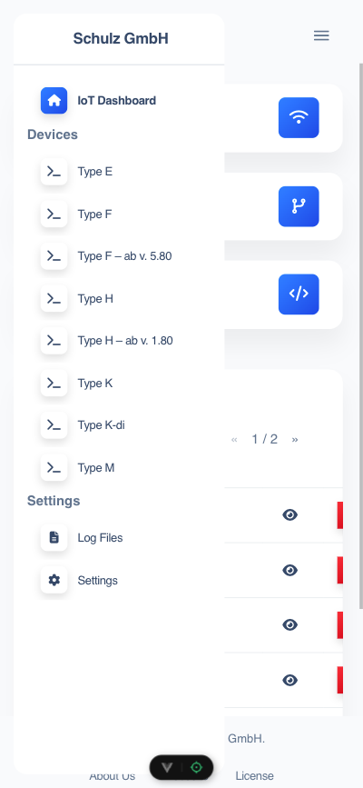
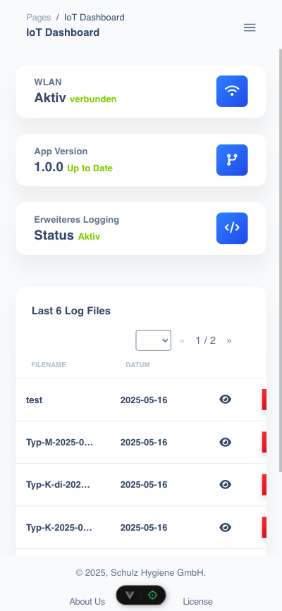
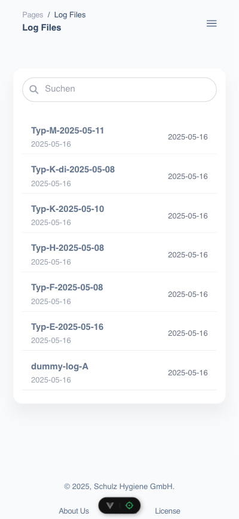
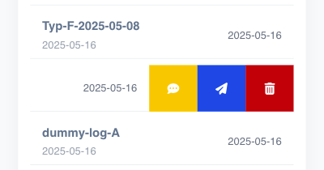
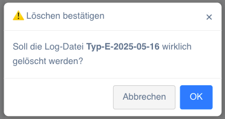
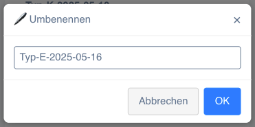
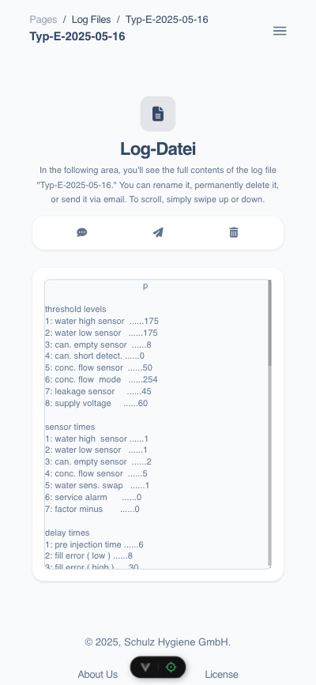
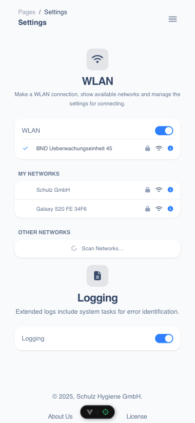
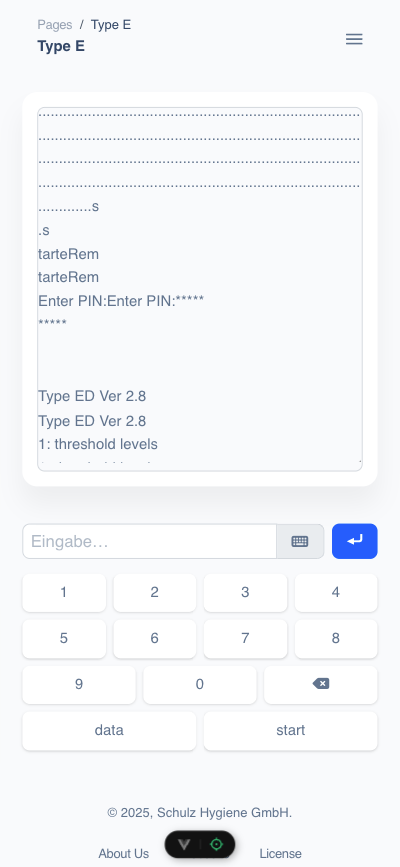

# HS-Access Modul – Bedienungsanleitung

## Inhaltsverzeichnis

1. [Überblick](#überblick)
2. [Voraussetzungen & Installation](#voraussetzungen--installation)
3. [Anmeldung & Zugriff](#anmeldung--zugriff)
4. [Bedienung](#bedienung)

    1. [Navigation (Sidebar)](#navigation-sidebar)
    2. [Dashboard](#dashboard)
    3. [Log-Dateien verwalten](#log-dateien-verwalten)

        - [Liste & Suche](#liste--suche)
        - [Swipe-Menü (Aktionen)](#swipe-menü-aktionen)
        - [Löschen](#löschen)
        - [Umbenennen](#umbenennen)
        - [Einzelne Log-Datei anzeigen & speichern](#einzelne-log-datei-anzeigen--speichern)

    4. [Einstellungen](#einstellungen)

        - [WLAN](#wlan)
        - [Logging](#logging)

    5. [Terminal (Type E)](#terminal-type-e)

        - [Ausgabe beobachten](#ausgabe-beobachten)
        - [Befehle eingeben](#befehle-eingeben)
        - [Log speichern](#log-speichern)

5. [Fehlerbehebung](#fehlerbehebung)

---

## Überblick

Das HS-Access Modul ist eine webbasierte Steuerungs- und Diagnoseoberfläche für die HS-DOS Geräte (Typ E, F, H, K, M).
Über einen WebBrowser oder die bereitgestellt iOS/Android App kann auf die verschiedenen verschiedene Funktionen zugefriffen werden:

-   **Dashboard**: Status von WLAN, App-Version und Logging
-   **Terminal** (nur für Typ E): Direkte Kommando­eingabe
-   **Log-Dateien**: Einsehen, Umbenennen, Löschen und Versenden von System-Logs
-   **Einstellungen**: WLAN-Konfiguration und erweitertes Logging

---

## Voraussetzungen & Installation

1. **Gerät im Netzwerk**
   Stelle sicher, dass sich das HS-Access Modul im gleichen WLAN (`Schulz GmbH - HS-Access`) wie das Smartphone oder PC/Tablet befindet.
2. **Browser**
   Unterstützte Browser:

    - Google Chrome (aktuellste Version)
    - Mozilla Firefox
    - Safari

3. **Zugriff**

    - Öffne im Browser die IP-Adresse des Geräts (`http://192.168.5.1` oder `http://hs-access.local`).
    - Gebe im Terminal den Geräte Pin ein.

---

## Anmeldung & Zugriff

1. Rufe im Browser die Modul-URL (`http://192.168.5.1` oder `http://hs-access.local`) auf.
2. Gebe auf der Geräte-Seite den Gräte-**PIN** ein (siehe Gerät-Dokumentation).
3. Nach erfolgreicher Anmeldung erscheint die **Seitenleiste (Sidebar)**.

---

## Bedienung

### Navigation (Sidebar)

-   **Schulz GmbH** – Kopfbereich
-   **IoT Dashboard** – Startseite
-   **Devices** – Auswahl Ihres Gerätetyps (Typ E, F, H, K, M)
-   **Log Files** – Übersicht aller Logs
-   **Settings** – WLAN & Logging

### Dashboard

Im Dashboard sehen Sie auf einen Blick:

-   **WLAN**

    -   Status „Aktiv/Deaktiviert"

-   **App Version**

    -   Aktuelle Firmware-Version
    -   Status „Up to Date“

-   **Erweitertes Logging**

    -   Anzeige „Aktiv/Deaktiviert

-   **Last 6 Log Files**
    -   Liste der letzten sechs Logs (Dateiname, Datum)
    -   Icon „Auge“ öffnet die Log-Datei
    -   Seitennavigation („‹‹ 1/2 ››“)

### Log-Dateien verwalten

Standardansicht aller Logs für das gewählte Gerät.

#### Liste & Suche

-   **Suchfeld** oben: Filtert Log-Dateien per Freitext.
-   **Liste**: Dateiname links, Datum rechts.

#### Swipe-Menü (Aktionen)

Wird ein Eintrag nach links gewischt, werden folgende Aktionen eingeblendet:

-   💬 Umbenenn
-   📤 Versenden
-   🗑️ Löschen

#### Löschen

1. Tippe auf das Mülleimer-Symbol.

2. Bestätigungsdialog erscheint:

    

3. **Abbrechen** oder **OK** wählen.

#### Umbenennen

1. Tippen auf Umbenennen.

2. Dialog:

    

3. Neuen Dateinamen eingeben → **OK**.

#### Einzelne Log-Datei anzeigen & speichern

1. In der Liste eine Log klicken

2. Inhalt wird angezeigt:

    

3. Aktionen:

-   💬 Umbenenn
-   📤 Versenden
-   🗑️ Löschen

### Einstellungen

#### WLAN

-   **WLAN ein/aus**: Toggle-Schalter.
-   **Aktuelles Netzwerk**: Anzeige + Icon-Leiste.
-   **My Networks**: Bereits einmal verbundenen WLan-Netze (SSIDs).
-   **Other Networks**: „Scan Networks…“ anzeige verfügbarer Netzwerke in der Umgebung.

#### Logging

-   **Extended Logging**: Ein/aus via Toggle.

### Terminal (Bsp.: Type E)

#### Ausgabe beobachten

-   Scrollbarer Log-Viewer.
-   Zeigt System- und Sensordaten in Echtzeit.

#### Befehle eingeben

-   Eingabefeld am unteren Rand.
-   Auf Keyboard-Icon tippen für On-Screen-Tastatur.
-   Numerisches Keypad + Funktionstasten:

    -   `data` – Parameter auslesen
    -   `start` – Messung starten
    -   Rückschritt (<kbd>⌫</kbd>)

1. Tippen Sie Ihren Befehl (z. B. `.s`, `starteRem`).
2. Drücken Sie ↵ → Befehl wird ausgeführt.

#### Log speichern

Beim öffnen des Terminals wird direkt und automatisch, sofern eine Dosiergerät angeschlossen, ein Dateiname für die Log-Datei abgefragt.

---

## Fehlerbehebung

| Problem                                      | Mögliche Ursache             | Lösung                                                             |
| -------------------------------------------- | ---------------------------- | ------------------------------------------------------------------ |
| Keine Verbindung zum Gerät                   | WLAN nicht verbunden         | WLAN in Einstellungen aktivieren; richtigen SSID auswählen.        |
| Dashboard zeigt „Offline“                    | Firmware eingefroren         | Modul neu starten (Strom aus/an).                                  |
| Log-Datei lässt sich nicht löschen           | Datei gesperrt               | Browser neu laden; ggf. Logging deaktivieren und erneut versuchen. |
| Umbenennen schlägt fehl                      | Ungültige Zeichen im Namen   | Nur alphanumerische Zeichen, Bindestriche und Unterstriche nutzen. |
| Suchfeld filtert nicht                       | Cacheprobleme im Browser     | Seite neu laden; Tastenkombination Ctrl + F5 (Hard-Reload).        |
| Terminal reagiert nicht auf Eingaben (Typ E) | Falscher Modus („Enter PIN“) | PIN erneut eingeben; ggf. Gerät neu booten.                        |

---

_Ende der Anleitung_
